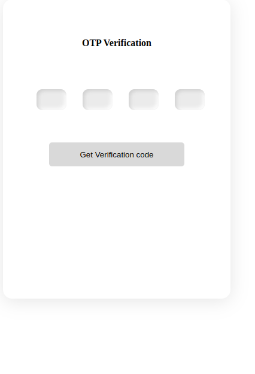

#### OTP Verification Project with React and Express
This is a small project that demonstrates how to implement OTP (One-Time Password) verification using React and Express. OTP is a commonly used method of verification in web and mobile applications, where a user receives a temporary password via SMS or email, and enters it into the application to verify their identity.

#### Using the Application
You will need to Run both Client and Servers on a suitable port. 
```nodejs
npm start server

```
Once both the front-end and back-end servers are running, you can open your web browser and navigate to the running address, E.g  http://localhost:3000. This will display the OTP verification form.

Enter your phone number in the input field and click the "Send OTP" button. This will send a POST request to the back-end server, which will generate an OTP and send it to your phone via SMS/Email

Once you receive the OTP, enter it into the input field and click the "Verify" button. This will send another POST request to the back-end server to verify the OTP. If the OTP is correct, you'll see a success message. If the OTP is incorrect, you'll see an error message.




##### Endoints
```markdown
/api/auth/register

method POST
body {
     phone : String
     name : String
}


2) /api/auth/login_with_phone

method POST
body {
     phone : String
}


3) /api/auth/verify_otp

method POST
body {
     otp : String
     userId : String
}


4) /api/auth/me

method GET
headers {
     Authorization : Bearer jwt_token
}
access for both ADMIN and USER role

5) /api/auth/admin

method GET
headers {
    Authorization : Bearer jwt_token
}

access for only ADMIN role

```